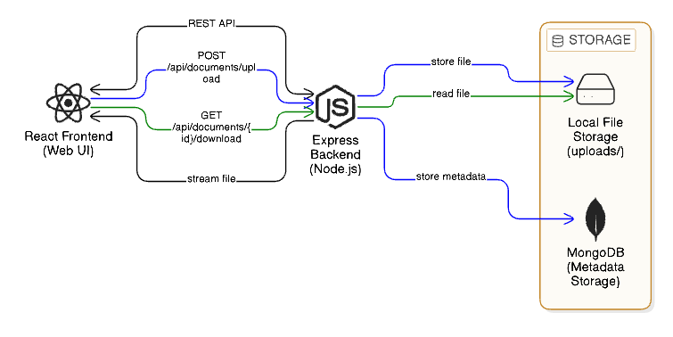
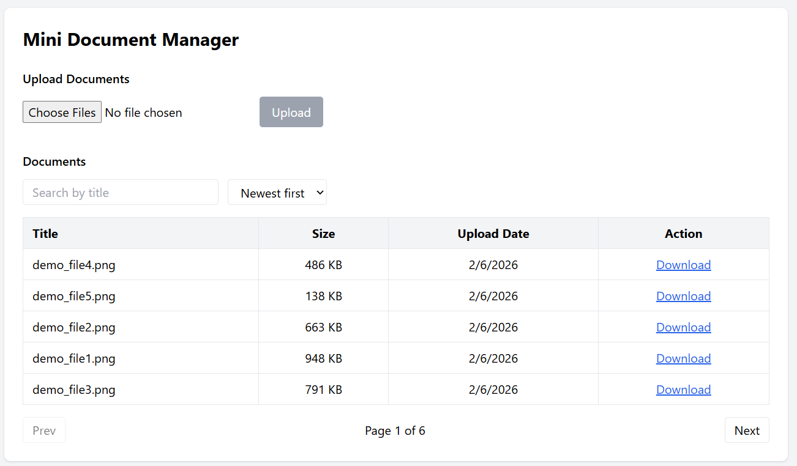
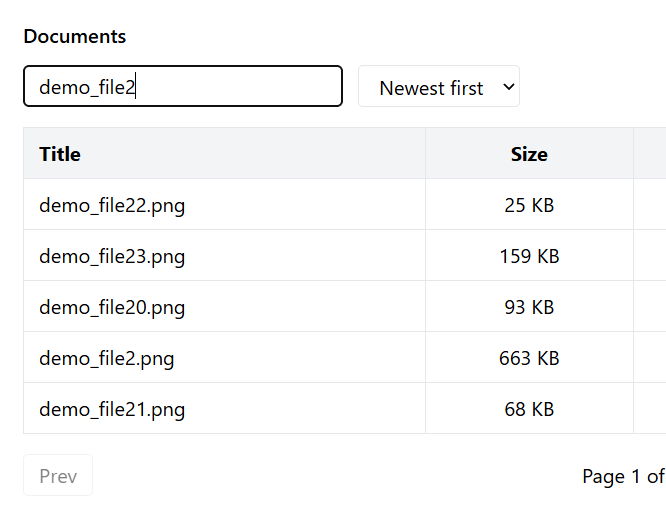
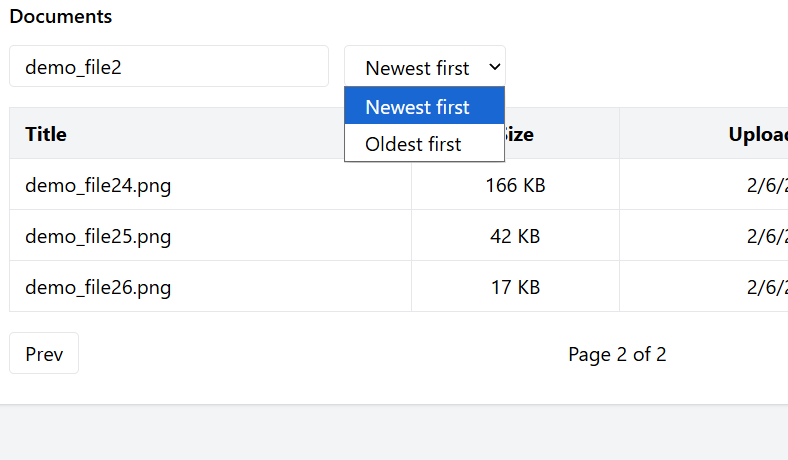

# Mini Document Manager

## Objective

Design and implement a minimal document manager that supports uploading, listing, searching, and downloading documents.

This project focuses on:

* Clean API and data design
* Full-stack thinking (frontend + backend)
* Ability to explain tradeoffs and constraints

> **Note:** This solution prioritizes clarity and correctness over breadth.
> The code is intended to be read and reviewed, not executed locally.

---

## Features Implemented

### 1. Upload Documents

* Users can upload **multiple documents in a single action**
* Each document includes:

  * **Title** (defaults to filename)
  * **File**
* Backend supports **multi-file upload** using `multipart/form-data`
* Files are stored on **local disk**
* Metadata stored separately in MongoDB:

  * title
  * file size
  * upload timestamp
  * file path

---

### 2. List Documents

The frontend displays a list of uploaded documents with:

* Title
* File size
* Upload date
* Download action

Backend supports:

* Pagination (`page`, `pageSize`)
* Sorting by upload date (ascending / descending)
* Text search on title (simple “contains” search using regex)

Frontend includes:

* Search input
* Sort control
* Pagination (Prev / Next)
* Loading and empty states

---

### 3. Download Document

* Users can download a document from the list
* Backend returns files using a **streaming response**
* Files are streamed from disk using `fs.createReadStream`
* Files are **never loaded fully into memory**

---

## Tech Stack

### Backend

* Node.js
* Express
* MongoDB (Atlas / Compass)
* Mongoose
* Multer (file uploads)
* Native filesystem streams

### Frontend

* React (Vite)
* Minimal UI styling (utility-based)
* No heavy UI frameworks

---

## Architecture Overview



### Upload Flow

Frontend → Backend → Disk + MongoDB

### Download Flow

Frontend → Backend → Stream file from disk → Browser

---

## API Endpoints

### Upload Documents

```
POST /api/documents/upload
```

* Multipart form data
* Field name: `files`
* Supports multiple files in one request

---

### List Documents

```
GET /api/documents
```

Query parameters:

* `page` (default: 1)
* `pageSize` (default: 10)
* `sort` (`asc` | `desc`)
* `search` (partial title match)

---

### Download Document

```
GET /api/documents/:id/download
```

* Streams file from disk
* Sets `Content-Disposition` for download

---
## Screenshots

### Full Application View

This screenshot shows the complete application layout, including the upload section and the document listing table with pagination.



### Search by Document Title

This screenshot demonstrates the text-based search functionality.  
Documents are filtered in real time using a simple “contains” search on the title.



### Search and Sort Combined

This screenshot shows search and sorting working together.  
Documents are filtered by title and sorted by upload date (newest first / oldest first).



---

## Design Questions

---

### 1. Multiple Uploads

The system supports uploading multiple documents in a **single request** using `multipart/form-data`. All files are processed together by the backend and stored in one operation.

**Tradeoffs:**

* Fewer network requests and simpler API design
* Larger request payloads, mitigated by basic file size limits
* Easier to handle atomic uploads compared to multiple individual requests

---

### 2. Streaming

Streaming is used for downloading documents to avoid loading the entire file into server memory.

**If the full file were loaded into memory:**

* Memory usage would increase significantly for large files
* Concurrent downloads could exhaust server resources
* The system would scale poorly and risk crashes

Using streaming ensures constant memory usage and safer handling of downloads.

---

### 3. Moving to S3

If files were moved to object storage such as S3:

* The backend would upload files directly to S3 instead of local disk
* MongoDB would store object metadata (bucket, key, URLs)
* The backend could return pre-signed URLs for downloads

In this setup, the backend would primarily coordinate access and would not need to stream file bytes itself.

---

### 4. Frontend UX

If more time were available:

* **Document Preview:** Add previews using content-type detection (e.g., inline preview for images or PDFs).
* **Upload Progress:** Show real-time upload progress using progress events (`XMLHttpRequest` or Axios `onUploadProgress`).

---

## Setup Assumptions

* Local MongoDB or MongoDB Atlas is available
* Node.js is installed
* Files are stored locally
* No authentication is required

---
## Key Tradeoffs Due to Time Constraints

* One test
* No file previews
* Minimal UI styling
* No authentication

These were intentionally excluded to keep the implementation simple and explainable.


